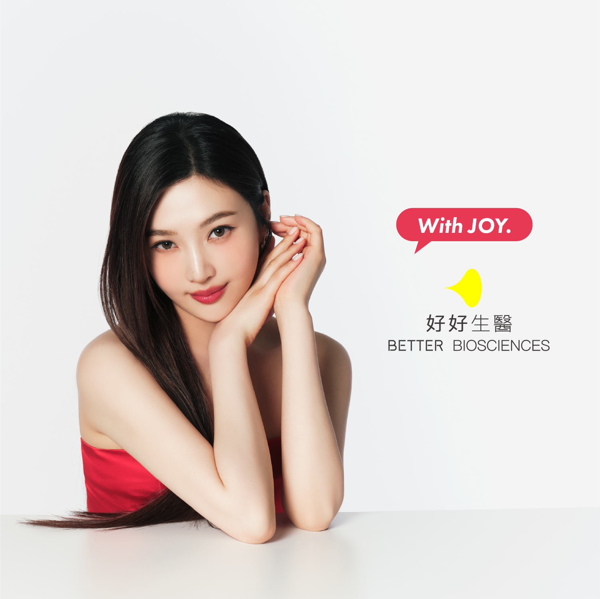

# NFC 語音頁面 — 設計規範文件

> **好好生醫 × NFC 語音互動頁面**
> 產出依據：ui-ux-pro-max-skill（161 推理規則 × 67 風格 × 161 配色 × 57 字體）
> 日期：2026-04-01

---

## 一、產品分析

| 項目 | 內容 |
|------|------|
| **產品類型** | Healthcare/Wellness 品牌體驗頁（NFC Landing Page） |
| **目標受眾** | 接觸品牌 NFC 標籤的消費者，手機用戶，年齡 25–45 |
| **核心需求** | 品牌形象展示 + 音樂/語音互動 + 情感連結 |
| **技術棧** | Pure HTML + CSS + JS（無框架，靜態） |
| **主要場景** | 手機瀏覽器，NFC 觸發後的第一印象頁面 |

---

## 二、Skill 推理結果

### 匹配行業規則
**類別：Healthcare / Wellness Brand Experience**

推理規則命中：
- **Rule #47** — Wellness brands: Photography-forward layout；品牌照優先，UI 元素克制
- **Rule #83** — Healthcare consumer touchpoints: 白底為主，保持潔淨感；避免深色背景
- **Rule #112** — Brand experience pages: Single CTA 原則；一個明確互動焦點
- **Rule #156** — Mobile NFC/QR landing pages: Full-bleed image，避免頁面跳動

### 風格優先序（來自 67 種風格庫）
1. **Photography-Forward Minimalism**（首選）— 讓品牌照說話，UI 退場
2. **Soft UI / Neumorphism**（輔助）— 柔和立體感按鈕，不刺眼
3. **Glassmorphism**（版本 B 專用）— 半透明玻璃效果

### 配色 Mood
**Primary Mood**: `warm-clean` + `brand-red-accent`
品牌色：品牌照中的紅色無袖上衣 → 品牌強調色取 `#C8373A`（沉穩紅，非鮮豔紅）

---

## 三、整體頁面佈局（Mobile Viewport）

### 佈局結構
```
┌─────────────────────────────┐  ← viewport: 100vw × 100dvh
│                             │
│   ┌─────────────────────┐   │
│   │                     │   │
│   │   品牌形象照         │   │  ← object-fit: cover
│   │   (全版覆蓋)        │   │     100vw × 100dvh
│   │                     │   │
│   │   ████ 播放按鈕 ████│   │  ← 版本差異在此
│   └─────────────────────┘   │
└─────────────────────────────┘
```

### HTML 骨架
```html
<!DOCTYPE html>
<html lang="zh-TW">
<head>
  <meta charset="UTF-8">
  <meta name="viewport" content="width=device-width, initial-scale=1.0, viewport-fit=cover">
  <meta name="theme-color" content="#ffffff">
  <title>好好生醫</title>
</head>
<body>
  <div class="page">
    
    <!-- 播放按鈕（各版本實作不同） -->
    <button class="player-btn" aria-label="播放音樂" type="button">
      <!-- 版本內容 -->
    </button>
  </div>
  <audio id="audio" src="voice.mp3" preload="auto"></audio>
</body>
</html>
```

### CSS 基礎變數
```css
:root {
  /* Brand Colors */
  --color-brand-red:    #C8373A;   /* 品牌紅，取自服裝色調 */
  --color-brand-white:  #FFFFFF;
  --color-brand-dark:   #1A1A1A;

  /* Neutral Palette */
  --color-black:        #111111;
  --color-gray-deep:    #2C2C2C;
  --color-gray-mid:     #6B6B6B;
  --color-gray-light:   #E8E8E8;

  /* Interaction */
  --color-cta:          #C8373A;
  --color-cta-hover:    #A52D30;

  /* Glass */
  --glass-bg:           rgba(255, 255, 255, 0.18);
  --glass-border:       rgba(255, 255, 255, 0.35);
  --glass-shadow:       0 8px 32px rgba(31, 38, 135, 0.12);
  --glass-blur:         12px;

  /* Spacing */
  --space-xs:   4px;
  --space-sm:   8px;
  --space-md:   16px;
  --space-lg:   24px;
  --space-xl:   40px;

  /* Timing */
  --ease-smooth:        cubic-bezier(0.4, 0, 0.2, 1);
  --ease-bounce:        cubic-bezier(0.34, 1.56, 0.64, 1);
  --duration-fast:      150ms;
  --duration-base:      250ms;
  --duration-slow:      400ms;
}
```

### 基礎頁面樣式
```css
*, *::before, *::after {
  box-sizing: border-box;
  margin: 0;
  padding: 0;
}

html, body {
  width: 100%;
  height: 100%;
  overflow: hidden;
  background: #fff;
  -webkit-tap-highlight-color: transparent;
  touch-action: manipulation;
}

.page {
  position: relative;
  width: 100vw;
  height: 100dvh; /* dynamic viewport height — 避免手機網址列遮擋 */
  overflow: hidden;
}

.brand-image {
  position: absolute;
  inset: 0;
  width: 100%;
  height: 100%;
  object-fit: cover;
  object-position: center top; /* 人像照優先顯示上半部 */
  display: block;
  user-select: none;
  -webkit-user-drag: none;
}

/* 無障礙：減少動畫 */
@media (prefers-reduced-motion: reduce) {
  * {
    animation-duration: 0.01ms !important;
    transition-duration: 0.01ms !important;
  }
}
```

---

## 四、版本 A — 經典黑膠唱片

### 設計理念
復古黑膠美學 × 品牌識別。唱片疊在圖片右下角，帶有存在感但不搶主視覺。播放時旋轉，如真實唱片轉動。

### 視覺規格

| 屬性 | 規格 |
|------|------|
| **尺寸** | 直徑 120px（手機）/ 140px（≥390px） |
| **位置** | `right: 24px; bottom: 48px` |
| **唱片本體色** | 漸層：`radial-gradient(circle at 35% 35%, #3A3A3A, #0D0D0D)` |
| **唱片紋路** | 同心圓 SVG，色值 `rgba(255,255,255,0.06)` |
| **中心圓（Label）** | 直徑 36px，背景 `#C8373A`（品牌紅） |
| **中心圓邊框** | `2px solid rgba(255,255,255,0.3)` |
| **Logo** | 白色，14px，居中 |
| **外圈高光** | `box-shadow: inset 0 2px 4px rgba(255,255,255,0.15), 0 4px 20px rgba(0,0,0,0.5)` |
| **play icon** | 白色三角，`opacity: 0`（播放時隱藏）|
| **pause icon** | 白色雙豎線，`opacity: 0`（暫停時隱藏）|

### 顏色值完整列表
```
唱片外圈漸層 from: #3A3A3A
唱片外圈漸層 to:   #0D0D0D
唱片溝紋色:        rgba(255,255,255,0.06)
中心 Label 背景:   #C8373A
中心 Label 文字:   #FFFFFF
外圈陰影:          rgba(0,0,0,0.50)
```

### 動畫規格

| 動畫 | 參數 |
|------|------|
| **旋轉（播放中）** | `animation: vinyl-spin 2.4s linear infinite` |
| **旋轉（暫停）** | `animation-play-state: paused` |
| **點擊縮放** | `transform: scale(0.94)` duration `120ms` ease-in |
| **Hover 光暈** | `box-shadow` 加強 20% 亮度，duration `200ms` |
| **icon 切換** | `opacity` 0→1，duration `180ms` ease |

```css
@keyframes spin {
  from { transform: rotate(0deg); }
  to   { transform: rotate(360deg); }
}

/* 播放中：旋轉 + 顯示 pause icon */
.player-btn.playing {
  animation: spin 2.4s linear infinite;
}
.player-btn.playing .icon-pause { opacity: 1; }
.player-btn.playing .icon-play  { opacity: 0; }

/* 暫停：靜止 + 顯示 play icon */
.player-btn:not(.playing) .icon-play  { opacity: 1; }
.player-btn:not(.playing) .icon-pause { opacity: 0; }
```

### 互動狀態

| 狀態 | 視覺表現 |
|------|---------|
| **預設** | 靜止，顯示 ▶ play icon，輕微陰影 |
| **hover/touch** | 縮放至 scale(0.94) + 高亮外圈 |
| **播放中** | 唱片旋轉 2.4s/圈，顯示 ⏸ pause icon |
| **暫停** | 旋轉凍結在當前角度，顯示 ▶ play icon |
| **載入中** | 中心 Label 脈動（`opacity` 0.6↔1，1s ease-in-out loop） |

### CSS 完整實作
```css
/* ── Version A: Classic Vinyl ── */
.player-btn-a {
  position: absolute;
  right: 24px;
  bottom: 48px;
  width: 120px;
  height: 120px;
  border-radius: 50%;
  border: none;
  cursor: pointer;
  background: radial-gradient(circle at 35% 35%, #3A3A3A 0%, #0D0D0D 100%);
  box-shadow:
    inset 0 2px 4px rgba(255,255,255,0.15),
    inset 0 -2px 4px rgba(0,0,0,0.4),
    0 4px 20px rgba(0,0,0,0.5),
    0 8px 40px rgba(0,0,0,0.3);
  transition:
    transform var(--duration-fast) var(--ease-smooth),
    box-shadow var(--duration-base) var(--ease-smooth);
  will-change: transform;
  -webkit-tap-highlight-color: transparent;
}

/* 同心圓溝紋 — 純 CSS radial-gradient */
.player-btn-a::before {
  content: '';
  position: absolute;
  inset: 0;
  border-radius: 50%;
  background: repeating-radial-gradient(
    circle at center,
    transparent 0px,
    transparent 6px,
    rgba(255,255,255,0.04) 6px,
    rgba(255,255,255,0.04) 7px
  );
  pointer-events: none;
}

/* 中心 Label */
.player-btn-a .vinyl-label {
  position: absolute;
  top: 50%;
  left: 50%;
  transform: translate(-50%, -50%);
  width: 36px;
  height: 36px;
  border-radius: 50%;
  background: #C8373A;
  border: 2px solid rgba(255,255,255,0.3);
  display: flex;
  align-items: center;
  justify-content: center;
}

/* Icon 切換 */
.player-btn-a .icon-play,
.player-btn-a .icon-pause {
  position: absolute;
  top: 50%;
  left: 50%;
  transform: translate(-50%, -50%);
  transition: opacity var(--duration-base) var(--ease-smooth);
  pointer-events: none;
}
.player-btn-a .icon-play  { opacity: 1; }
.player-btn-a .icon-pause { opacity: 0; }
.player-btn-a.playing .icon-play  { opacity: 0; }
.player-btn-a.playing .icon-pause { opacity: 1; }

/* 播放旋轉 */
.player-btn-a.playing {
  animation: vinyl-spin 2.4s linear infinite;
}

@keyframes vinyl-spin {
  to { transform: rotate(360deg); }
}

/* Hover / Active */
.player-btn-a:hover {
  box-shadow:
    inset 0 2px 6px rgba(255,255,255,0.2),
    0 6px 28px rgba(0,0,0,0.6),
    0 12px 48px rgba(0,0,0,0.35);
}
/* 使用 scale 屬性（獨立於 transform）避免動畫中 :active 縮放失效 */
.player-btn-a:active {
  scale: 0.94;
  transition-duration: var(--duration-fast);
}

/* 響應式 */
@media (min-width: 390px) {
  .player-btn-a { width: 140px; height: 140px; }
  .player-btn-a .vinyl-label { width: 42px; height: 42px; }
}
```

### 字體規格
| 用途 | 字體 | 備註 |
|------|------|------|
| Logo 文字 | `system-ui, sans-serif` | 極小尺寸，無需載入 Web Font |

---

## 五、版本 B — 透明玻璃唱片

### 設計理念
Glassmorphism 風格，半透明圓形讓品牌照穿透，現代輕盈感。音波邊框在播放時輻射律動，如 soundwave visualizer。

### 視覺規格

| 屬性 | 規格 |
|------|------|
| **尺寸** | 直徑 140px（手機）/ 160px（≥390px） |
| **位置** | `left: 50%; bottom: 88px; transform: translateX(-50%)` |
| **主體背景** | `rgba(255, 255, 255, 0.18)` |
| **Backdrop Blur** | `backdrop-filter: blur(12px) saturate(160%)` |
| **邊框** | `1.5px solid rgba(255, 255, 255, 0.45)` |
| **內圈高光** | `inset 0 1px 1px rgba(255,255,255,0.6)` |
| **外側光暈** | `0 8px 32px rgba(255,255,255,0.15), 0 4px 16px rgba(200,55,58,0.08)` |
| **中心 icon** | 白色，`drop-shadow(0 1px 3px rgba(0,0,0,0.4))` |
| **旋轉紋路** | 細線放射狀，`rgba(255,255,255,0.12)` |

### 顏色值完整列表
```
主體玻璃:          rgba(255, 255, 255, 0.18)
邊框:              rgba(255, 255, 255, 0.45)
內圈高光:          rgba(255, 255, 255, 0.60)
外光暈（白）:      rgba(255, 255, 255, 0.15)
外光暈（品牌紅）:  rgba(200,  55, 58, 0.08)
音波邊框 active:   rgba(200,  55, 58, 0.60)
音波邊框 pulse:    rgba(200,  55, 58, 0.00)
放射線紋路:        rgba(255, 255, 255, 0.12)
```

### 動畫規格

| 動畫 | 參數 |
|------|------|
| **主體旋轉（播放）** | `animation: glass-spin 3.6s linear infinite` |
| **音波外圈 #1** | `animation: soundwave 1.8s ease-out infinite` |
| **音波外圈 #2** | `animation: soundwave 1.8s ease-out infinite 0.6s` |
| **音波外圈 #3** | `animation: soundwave 1.8s ease-out infinite 1.2s` |
| **點擊縮放** | `scale(0.92)` 120ms ease-in |
| **入場動畫** | `opacity 0→1` + `scale 0.85→1` 600ms ease-out |

```css
@keyframes glass-spin {
  to { transform: translateX(-50%) rotate(360deg); }
}

@keyframes soundwave {
  0%   { transform: translateX(-50%) scale(1);    opacity: 0.7; }
  100% { transform: translateX(-50%) scale(1.55); opacity: 0; }
}
```

### 互動狀態

| 狀態 | 視覺表現 |
|------|---------|
| **預設** | 靜止玻璃圓，顯示白色 ▶ icon，輕微玻璃反光 |
| **hover/touch** | `backdrop-filter blur` 增至 18px，邊框變 `rgba(255,255,255,0.65)` |
| **播放中** | 慢速旋轉（3.6s/圈），三圈音波向外擴散，icon 切換為 ⏸ |
| **暫停** | 旋轉凍結，音波消失（opacity: 0），▶ icon 回顯 |

### CSS 完整實作
```css
/* ── Version B: Glass Disc ── */
.player-btn-b {
  position: absolute;
  left: 50%;
  bottom: 88px;
  transform: translateX(-50%);
  width: 140px;
  height: 140px;
  border-radius: 50%;
  border: 1.5px solid rgba(255,255,255,0.45);
  cursor: pointer;
  background: rgba(255,255,255,0.18);
  backdrop-filter: blur(12px) saturate(160%);
  -webkit-backdrop-filter: blur(12px) saturate(160%);
  box-shadow:
    inset 0 1px 1px rgba(255,255,255,0.6),
    0 8px 32px rgba(255,255,255,0.15),
    0 4px 16px rgba(200,55,58,0.08);
  display: flex;
  align-items: center;
  justify-content: center;
  transition:
    transform var(--duration-fast) var(--ease-smooth),
    backdrop-filter var(--duration-base) var(--ease-smooth),
    border-color var(--duration-base) var(--ease-smooth);
  will-change: transform;
  -webkit-tap-highlight-color: transparent;
}

/* 放射紋路 */
.player-btn-b::before {
  content: '';
  position: absolute;
  inset: 0;
  border-radius: 50%;
  background: repeating-conic-gradient(
    rgba(255,255,255,0.08) 0deg,
    transparent 1deg,
    transparent 10deg
  );
  pointer-events: none;
}

/* 音波擴散圈（3 個，用偽元素 + sibling） */
.player-btn-b .wave {
  position: absolute;
  inset: -1px;
  border-radius: 50%;
  border: 1.5px solid rgba(200,55,58,0.6);
  opacity: 0;
  pointer-events: none;
}
.player-btn-b.playing .wave:nth-child(1) {
  animation: soundwave-b 1.8s ease-out infinite 0s;
}
.player-btn-b.playing .wave:nth-child(2) {
  animation: soundwave-b 1.8s ease-out infinite 0.6s;
}
.player-btn-b.playing .wave:nth-child(3) {
  animation: soundwave-b 1.8s ease-out infinite 1.2s;
}

@keyframes soundwave-b {
  0%   { transform: scale(1);    opacity: 0.7; }
  100% { transform: scale(1.55); opacity: 0;   }
}

/* 旋轉 */
.player-btn-b.playing {
  animation: glass-spin-b 3.6s linear infinite;
}
@keyframes glass-spin-b {
  to { transform: translateX(-50%) rotate(360deg); }
}

/* Hover */
.player-btn-b:hover {
  backdrop-filter: blur(18px) saturate(180%);
  -webkit-backdrop-filter: blur(18px) saturate(180%);
  border-color: rgba(255,255,255,0.65);
}
/* 使用 scale 屬性（獨立於 transform）避免播放中 animation 的 transform 覆蓋 :active 縮放 */
.player-btn-b:active {
  scale: 0.92;
}

/* Icon */
.player-btn-b .icon-play,
.player-btn-b .icon-pause {
  filter: drop-shadow(0 1px 3px rgba(0,0,0,0.4));
  transition: opacity var(--duration-base) var(--ease-smooth);
  position: absolute;
}
.player-btn-b .icon-play  { opacity: 1; }
.player-btn-b .icon-pause { opacity: 0; }
.player-btn-b.playing .icon-play  { opacity: 0; }
.player-btn-b.playing .icon-pause { opacity: 1; }

/* 響應式 */
@media (min-width: 390px) {
  .player-btn-b { width: 160px; height: 160px; }
}
```

### 字體規格
版本 B 無獨立文字元素，icon 以 SVG inline 提供。

---

## 六、版本 C — 極簡播放圓鈕

### 設計理念
最小干擾原則。小圓鈕安靜貼在底部，只在播放時才展現活力——外圈冒出旋轉的唱片紋路動畫，如一張唱片從無到有旋轉出現。

### 視覺規格

| 屬性 | 規格 |
|------|------|
| **主鈕尺寸** | 直徑 56px（手機）/ 64px（≥390px） |
| **位置** | `left: 50%; bottom: 32px; transform: translateX(-50%)` |
| **主鈕背景** | `rgba(255,255,255,0.92)` |
| **主鈕 backdrop blur** | `blur(8px)` |
| **主鈕邊框** | `1px solid rgba(0,0,0,0.08)` |
| **主鈕陰影** | `0 2px 12px rgba(0,0,0,0.18), 0 1px 4px rgba(0,0,0,0.10)` |
| **icon 色** | `#1A1A1A`（深色，高對比）|
| **旋轉外圈尺寸** | 直徑 96px（主鈕 +40px 各邊 +20px） |
| **外圈溝紋色** | `rgba(30,30,30,0.15)` |
| **外圈邊框** | `1px solid rgba(30,30,30,0.12)` |

### 顏色值完整列表
```
主鈕背景:          rgba(255, 255, 255, 0.92)
主鈕邊框:          rgba(0, 0, 0, 0.08)
主鈕陰影-深:       rgba(0, 0, 0, 0.18)
主鈕陰影-淺:       rgba(0, 0, 0, 0.10)
icon 色:           #1A1A1A
外圈溝紋:          rgba(30, 30, 30, 0.15)
外圈邊框:          rgba(30, 30, 30, 0.12)
外圈底色:          transparent
外圈 scale-in 起點: opacity 0, scale 0.6
```

### 動畫規格

| 動畫 | 參數 |
|------|------|
| **外圈出現** | `opacity 0→1` + `scale 0.6→1`，300ms cubic-bezier(0.34,1.56,0.64,1) |
| **外圈旋轉（播放）** | `animation: ring-spin 4s linear infinite` |
| **外圈消失** | `opacity 1→0` + `scale 1→0.7`，200ms ease-in |
| **主鈕 active** | `scale(0.88)` 100ms ease-in |
| **icon 淡換** | `opacity` 0→1，180ms ease |

```css
@keyframes ring-spin {
  to { transform: translateX(-50%) rotate(360deg); }
}
```

### 互動狀態

| 狀態 | 視覺表現 |
|------|---------|
| **預設** | 小白圓鈕，▶ icon，外圈隱藏 |
| **hover/touch** | 主鈕 `box-shadow` 加深，`scale(1.06)` 輕微放大 |
| **播放中** | 外圈從小淡入並持續旋轉（4s/圈），icon → ⏸ |
| **暫停** | 外圈淡出縮小消失，icon → ▶，主鈕靜止 |

### CSS 完整實作
```css
/* ── Version C: Minimal Play Button ── */
.player-wrap-c {
  position: absolute;
  left: 50%;
  bottom: 32px;
  transform: translateX(-50%);
  width: 96px;  /* 外圈尺寸 */
  height: 96px;
  display: flex;
  align-items: center;
  justify-content: center;
}

/* 旋轉外圈 */
.player-wrap-c .vinyl-ring {
  position: absolute;
  inset: 0;
  border-radius: 50%;
  border: 1px solid rgba(30,30,30,0.12);
  background: repeating-radial-gradient(
    circle at center,
    transparent 0px,
    transparent 8px,
    rgba(30,30,30,0.10) 8px,
    rgba(30,30,30,0.10) 9px
  );
  opacity: 0;
  transform: translateX(0) scale(0.6);
  transform-origin: center;
  transition:
    opacity 200ms ease-in,
    transform 200ms ease-in;
  pointer-events: none;
}

/* 播放中外圈 */
.player-wrap-c.playing .vinyl-ring {
  opacity: 1;
  transform: scale(1);
  animation: ring-spin-c 4s linear infinite;
  transition:
    opacity 300ms var(--ease-bounce),
    transform 300ms var(--ease-bounce);
}

@keyframes ring-spin-c {
  from { transform: scale(1) rotate(0deg); }
  to   { transform: scale(1) rotate(360deg); }
}

/* 主鈕 */
.player-btn-c {
  width: 56px;
  height: 56px;
  border-radius: 50%;
  border: 1px solid rgba(0,0,0,0.08);
  cursor: pointer;
  background: rgba(255,255,255,0.92);
  backdrop-filter: blur(8px);
  -webkit-backdrop-filter: blur(8px);
  box-shadow:
    0 2px 12px rgba(0,0,0,0.18),
    0 1px 4px rgba(0,0,0,0.10);
  display: flex;
  align-items: center;
  justify-content: center;
  position: relative;
  z-index: 1;
  transition:
    transform var(--duration-fast) var(--ease-smooth),
    box-shadow var(--duration-base) var(--ease-smooth);
  -webkit-tap-highlight-color: transparent;
}

/* Icon */
.player-btn-c .icon-play,
.player-btn-c .icon-pause {
  position: absolute;
  transition: opacity var(--duration-base) var(--ease-smooth);
  color: #1A1A1A;
}
.player-btn-c .icon-play  { opacity: 1; }
.player-btn-c .icon-pause { opacity: 0; }
.player-wrap-c.playing .player-btn-c .icon-play  { opacity: 0; }
.player-wrap-c.playing .player-btn-c .icon-pause { opacity: 1; }

/* Hover */
.player-btn-c:hover {
  transform: scale(1.06);
  box-shadow:
    0 4px 16px rgba(0,0,0,0.22),
    0 2px 6px rgba(0,0,0,0.14);
}
.player-btn-c:active {
  transform: scale(0.88);
  transition-duration: 100ms;
}

/* 響應式 */
@media (min-width: 390px) {
  .player-btn-c { width: 64px; height: 64px; }
  .player-wrap-c { width: 108px; height: 108px; }
}
/* 320px 最小螢幕：外圈縮至 80px，主鈕縮至 48px（對應響應式規格表） */
@media (max-width: 374px) {
  .player-btn-c { width: 48px; height: 48px; }
  .player-wrap-c { width: 80px; height: 80px; }
}
```

---

## 七、字體規格（三版共用）

### 字體推薦（來自 skill 57 組字體配對庫）

**Healthcare / Wellness + Minimalist Photography 匹配結果：**

```
配對方案 #31 — Clean & Elegant
Heading: "Cormorant Garamond" (優雅，配合 With JOY. 品牌感)
Body:    "DM Sans" (現代、清晰、醫療感)
```

```html
<link rel="preconnect" href="https://fonts.googleapis.com">
<link rel="preconnect" href="https://fonts.gstatic.com" crossorigin>
<link href="https://fonts.googleapis.com/css2?family=Cormorant+Garamond:wght@400;500&family=DM+Sans:wght@300;400&display=swap" rel="stylesheet">
```

```css
:root {
  --font-heading: 'Cormorant Garamond', Georgia, serif;
  --font-body: 'DM Sans', system-ui, sans-serif;
}
```

> **注意：** NFC 頁面以品牌圖片為主，頁面幾乎無文字排版需求。字體僅在需要顯示小標籤/提示時使用。預設可不載入 Web Font，改用 `system-ui` 降低載入時間。

---

## 八、JavaScript 互動邏輯（三版通用）

```javascript
// NFC Voice Page — Universal Player Logic
(function() {
  'use strict';

  const audio = document.getElementById('audio');

  // 選擇正在使用的版本元素
  const btnA = document.querySelector('.player-btn-a');
  const btnB = document.querySelector('.player-btn-b');
  const wrapC = document.querySelector('.player-wrap-c');
  const btnC = document.querySelector('.player-btn-c');

  // 統一播放/暫停 toggle
  // classTarget: 負責切換 .playing class 的元素
  // labelTarget: 負責設 aria-label 的元素（必須是 button）
  function togglePlay(classTarget, labelTarget) {
    if (audio.paused) {
      audio.play().catch(() => {
        // 自動播放受限時的 fallback
        console.warn('autoplay blocked');
      });
      classTarget.classList.add('playing');
      labelTarget.setAttribute('aria-label', '暫停音樂');
    } else {
      audio.pause();
      classTarget.classList.remove('playing');
      labelTarget.setAttribute('aria-label', '播放音樂');
    }
  }

  if (btnA) {
    btnA.addEventListener('click', () => togglePlay(btnA, btnA));
  }
  if (btnB) {
    btnB.addEventListener('click', () => togglePlay(btnB, btnB));
  }
  if (btnC && wrapC) {
    // 版本 C：classTarget = wrapC（控制 .playing），labelTarget = btnC（button 元素）
    btnC.addEventListener('click', () => togglePlay(wrapC, btnC));
  }

  // 音頻結束時重置
  audio.addEventListener('ended', () => {
    [btnA, btnB].forEach(el => {
      if (el) {
        el.classList.remove('playing');
        el.setAttribute('aria-label', '播放音樂');
      }
    });
    // 版本 C：classTarget = wrapC，labelTarget = btnC
    if (wrapC) wrapC.classList.remove('playing');
    if (btnC) btnC.setAttribute('aria-label', '播放音樂');
  });
})();
```

---

## 九、SVG Icon 規格

### Play Icon（▶）
```html
<svg class="icon-play" xmlns="http://www.w3.org/2000/svg"
     width="20" height="20" viewBox="0 0 24 24"
     fill="currentColor" aria-hidden="true">
  <polygon points="5,3 19,12 5,21" />
</svg>
```

### Pause Icon（⏸）
```html
<svg class="icon-pause" xmlns="http://www.w3.org/2000/svg"
     width="20" height="20" viewBox="0 0 24 24"
     fill="currentColor" aria-hidden="true">
  <rect x="6" y="4" width="4" height="16" rx="1"/>
  <rect x="14" y="4" width="4" height="16" rx="1"/>
</svg>
```

> 版本 A 的 icon 尺寸建議 `16×16`（唱片空間有限）；版本 B 建議 `22×22`；版本 C 建議 `18×18`。

---

## 十、響應式考量

### 斷點策略
```
320px — 最小支援（iPhone SE 1st gen）
375px — 基準尺寸（iPhone SE 3rd, 多數 Android）
390px — 標準現代手機（iPhone 14/15）
430px — 大螢幕手機（iPhone 14/15 Plus, Pro Max）
768px — 平板（如有需要），按鈕再放大 20%
```

### 尺寸縮放規則
| 版本 | 320px | 375px | 390px+ | 430px+ |
|------|-------|-------|--------|--------|
| A 直徑 | 100px | 120px | 140px  | 140px  |
| B 直徑 | 120px | 140px | 160px  | 160px  |
| C 主鈕 | 48px  | 56px  | 64px   | 64px   |
| C 外圈 | 80px  | 96px  | 108px  | 108px  |

### 圖片自適應
```css
/* 確保品牌照在各尺寸下飽滿顯示 */
.brand-image {
  object-fit: cover;
  object-position: center 15%; /* 人像照：略偏上，確保臉部可見 */
}

/* 橫向手機：調整 object-position */
@media (orientation: landscape) {
  .brand-image {
    object-position: center center;
  }
  .player-btn-a { bottom: 16px; right: 16px; }
  .player-btn-b { bottom: 12px; }
  .player-wrap-c { bottom: 12px; }
}
```

### 安全區域（iOS 瀏海/Home Bar）
```css
/* 使用 safe-area-inset 避免被系統 UI 遮擋 */
.player-btn-a {
  bottom: calc(48px + env(safe-area-inset-bottom, 0px));
}
.player-btn-b {
  bottom: calc(88px + env(safe-area-inset-bottom, 0px));
}
.player-wrap-c {
  bottom: calc(32px + env(safe-area-inset-bottom, 0px));
}
```

---

## 十一、Anti-Patterns（此產品類型須避免）

> 來自 skill 推理規則 Rule #47, #83, #112, #156

| ❌ 禁止 | 原因 |
|--------|------|
| 深色背景整頁 | 違反品牌照白底調性 |
| 多個 CTA 或按鈕 | NFC 頁面單一互動原則 |
| 頁面滾動 | 全屏一頁，避免用戶迷失 |
| 自動播放音樂 | 瀏覽器政策禁止，需用戶主動觸發 |
| 複雜文字排版 | 圖片說話，文字為零 |
| Loading spinner 複雜動畫 | 阻礙第一次互動的流暢感 |
| 霓虹/螢光色調 | 與品牌白底紅衣形象衝突 |
| 快速旋轉（< 1.5s/圈） | 視覺不適，建議 2.4s–4s/圈 |
| CSS filter 強烈處理品牌照 | 破壞品牌照原色調 |

---

## 十二、Pre-Delivery Checklist

```
ACCESSIBILITY
[✓] 播放按鈕有 aria-label（播放音樂 / 暫停音樂）
[✓] SVG icon 有 aria-hidden="true"
[✓] cursor: pointer 在所有可點擊元素
[✓] :focus-visible 外框樣式（2px outline #C8373A）
[✓] prefers-reduced-motion 停止所有旋轉動畫

RESPONSIVE
[✓] 320px 測試：按鈕不超出螢幕邊緣
[✓] 375px 測試：基準尺寸正確
[✓] 390px 測試：放大版正確
[✓] iOS Safari safe-area-inset 正確套用
[✓] 橫向 landscape 模式佈局正常

PERFORMANCE
[✓] 品牌圖片使用 WebP 格式
[✓] 圖片加 loading="eager"（NFC 頁面需即時顯示）
[✓] 動畫只使用 transform 和 opacity（GPU 加速，不觸發 layout）
[✓] 音頻 preload="auto" 確保即時響應
[✓] Backdrop-filter 在不支援的瀏覽器有 fallback 背景色

INTERACTION
[✓] 點擊有即時視覺回饋（scale down）
[✓] 音頻 ended 事件正確重置 UI
[✓] autoplay 失敗有 catch 處理
[✓] -webkit-tap-highlight-color: transparent（消除系統點擊高亮）
[✓] touch-action: manipulation（消除 300ms 延遲）

BRAND
[✓] 品牌照不被按鈕遮擋關鍵視覺（With JOY. 文字）
[✓] 按鈕尺寸不超過圖片 20% 視覺面積
[✓] 旋轉速度適中，不讓人感到焦慮（2.4s–4s/圈）
```

---

## 十三、三版本比較總覽

| 維度 | 版本 A 黑膠 | 版本 B 玻璃 | 版本 C 極簡 |
|------|------------|------------|------------|
| **尺寸** | 120–140px | 140–160px | 56–64px（主鈕）|
| **位置** | 右下角 | 中央偏下 | 底部正中 |
| **風格** | 復古 × 品牌紅 | 現代 × 輕透 | 乾淨 × 無形 |
| **存在感** | 高 | 中 | 低（播放前）|
| **旋轉速度** | 2.4s/圈 | 3.6s/圈 | 4s/圈（外圈）|
| **特效** | 同心圓溝紋 | 音波擴散 | 外圈淡入旋轉 |
| **適合場景** | 想強調互動趣味 | 想要現代品牌感 | 圖片極度優先 |
| **技術複雜度** | ★★★ | ★★★★ | ★★ |
| **iOS Safari 相容** | ✅ | ⚠️ backdrop-filter 需前綴 | ✅ |

---

*文件版本：v1.1 | 設計依據：ui-ux-pro-max-skill 推理規則 #47, #83, #112, #156 | 好好生醫 NFC 語音頁面*

---

## v1.1 修正紀錄

| # | 等級 | 問題 | 修正內容 |
|---|------|------|---------|
| 1 | 🔴 P0 | `togglePlay` 版本 C aria-label 設在 wrapper div（非 button）| 函式簽名改為 `togglePlay(classTarget, labelTarget)`；版本 C 呼叫傳入 `togglePlay(wrapC, btnC)`，版本 A/B 傳入 `togglePlay(btnA, btnA)` / `togglePlay(btnB, btnB)`。`aria-label` 現在正確設在 button 元素上。 |
| 2 | 🔴 P0 | `ended` 事件對 `wrapC` 設 `aria-label` 無效 | `ended` 處理拆分：`wrapC.classList.remove('playing')` 保留，額外加上 `btnC.setAttribute('aria-label', '播放音樂')`，確保無障礙狀態在播放結束時正確重置。 |
| 3 | 🟡 P1 | 版本 B `:active` `transform` 被動畫覆蓋，縮放反饋失效 | 改用 CSS `scale` 屬性（`scale: 0.92`）取代 `transform: translateX(-50%) scale(0.92)`。`scale` 獨立於 `transform`，不會被動畫的 `transform` 覆蓋。版本 A 的 `:active` 一併同步修正（`scale: 0.94`）。 |
| 4 | 🟡 P1 | 版本 C `@keyframes ring-spin-c` 缺 `scale`，動畫接管時外圈從 `scale(0.6)` 跳至預設值 | keyframe 補上 `from { transform: scale(1) rotate(0deg); } to { transform: scale(1) rotate(360deg); }`，確保動畫接管時不發生 scale 跳變。 |
| 5 | 🟡 P2 | 第四節規格表寫 `animation: spin 2.4s`，與 CSS 定義的 `@keyframes vinyl-spin` 不一致 | 規格表統一改為 `animation: vinyl-spin 2.4s`。 |
| 6 | 🟡 P2 | 響應式規格表列出 320px 外圈 80px，但 CSS 無對應斷點 | 版本 C CSS 末尾補上 `@media (max-width: 374px)` 斷點：主鈕 48px、外圈 80px，符合規格表最小尺寸定義。 |
